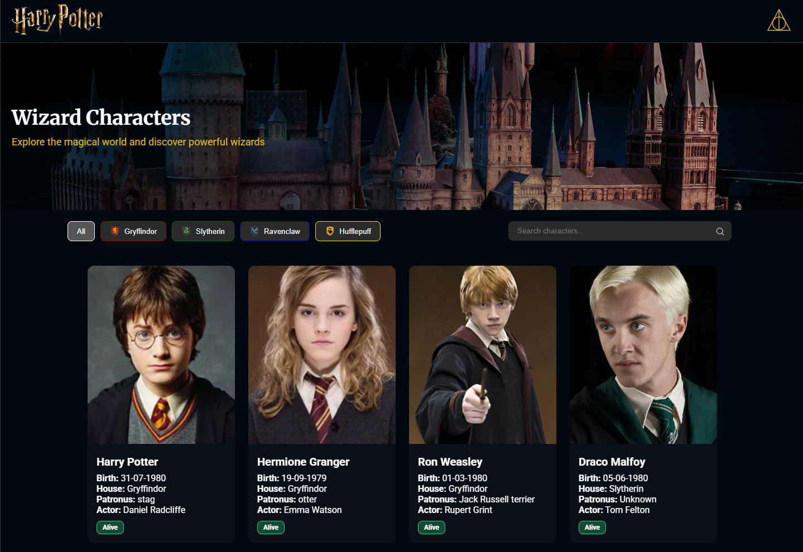

# 🧙 Wizard Characters App

Aplicação desenvolvida em React para listagem de personagens de um universo mágico, consumindo uma API pública e exibindo informações relevantes de forma organizada, responsiva e com boa experiência de usuário.

---

## 🔗 Deploy

👉 https://test-hp-stefanini.vercel.app/

---

## 📸 Preview



---

## 🚀 Funcionalidades

* 📋 Listagem de personagens
* 🏠 Filtro por casas
* 🔍 Busca por nome, ator, casa, patrono e espécie
* ➕ Paginação com botão **Load more**
* ⏳ Skeleton loading durante carregamento
* 🖼️ Fallback para imagens quebradas
* ⬆️ Botão "Back to top"
* 🎨 Animação suave na entrada dos cards
* 📱 Layout totalmente responsivo
* 🎭 Hero com overlay em gradiente

---

## 🛠️ Tecnologias utilizadas

* React
* TypeScript
* SCSS (Sass)
* Vite
* API REST

---

## 📦 Como rodar o projeto

Clone o repositório:

```bash
git clone https://github.com/Danielchenko/test-hp-stefanini.git
```

Acesse a pasta do projeto:

```bash
cd test-hp-stefanini
```

Instale as dependências:

```bash
npm install
```

Execute o projeto:

```bash
npm run dev
```

---

## 📁 Estrutura do projeto

```
src/
  components/
  hooks/
  services/
  types/
  layout/
  styles/
```

---

## 🧠 Decisões técnicas

* Separação de responsabilidades utilizando componentes reutilizáveis
* Uso de custom hooks para consumo de API (`useCharacters`)
* Implementação de filtros combinados (busca + categoria)
* Controle de estado para paginação incremental
* Uso de skeleton loading para melhorar a percepção de performance
* Animações com delay progressivo para melhor experiência visual
* Tratamento de estados da aplicação (loading, error, empty)

---

## 📌 Melhorias futuras

* Implementar debounce na busca
* Paginação via API
* Testes automatizados (unitários e integração)
* Melhorias de acessibilidade (a11y)
* Otimização de performance (memoização e lazy loading)

---

## 👨‍💻 Autor

Desenvolvido por **Daniel Carvalho**
